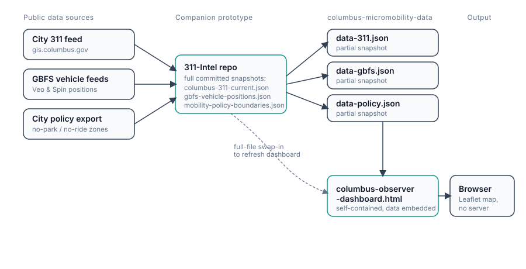

# Columbus Micromobility Data

An independent, public-data-only look at shared-scooter operations in Columbus, Ohio — 311 complaint activity, published vehicle positions, and city policy boundaries. Built and maintained by Steven Needham as a personal project. **Not affiliated with, endorsed by, or built using data from any current or former employer** — everything here comes from public sources: the City of Columbus 311 feed, published GBFS vehicle-position data, and Columbus's published mobility policy boundaries.

## Project identity

This project uses **Field Ledger**, an independent observer-oriented design system derived from Steven Needham's evidence-first practice while maintaining its own typography, palette, mark, and publication voice.

- [Living design-system reference](design-system.html)
- [Implementation guide](DESIGN_SYSTEM.md)

## Architecture



Four public sources → complete snapshots stored as `data-*.json` → embedded directly into `index.html` → rendered client-side in the browser. The 311, GBFS, and policy analysis snapshots are built through the companion [`311-Intel`](https://github.com/steveneedham/311-Intel) repo; Columbus Ride Hubs come directly from the City of Columbus public CoGo station layer. No server, no database, no build step. The dashed line marks the fastest path to a full refresh: swap the full files from `311-Intel` into this repo's `data-*.json` and reload.

## What's here

### `index.html`
A single self-contained HTML dashboard — no build step, no server required. Open it directly in a browser. It renders a Leaflet map of Columbus with six layers you can toggle independently:

- **311 requests** — shared bike/scooter complaints from the City's public feed, color-coded by a priority heuristic (critical / high / standard) derived from complaint type. Click a marker for source ID, address, zone, status, and a link back to the source record.
- **GBFS vehicle positions** — published Veo and Spin vehicle locations, filterable by operator and availability.
- **Cross-vendor pile-ups** — clusters of four or more vehicles from more than one operator within ~20 metres of each other, flagged as a review signal (not a confirmed violation).
- **Policy boundaries** — published no-parking, mandatory-parking, and no-ride zones.
- **Populus MDS Geographies** — the complete supplied MDS geography export: 110 named geographies and 147 polygon/multipolygon features, toggleable as a separate map layer.
- **Columbus Ride Hubs** — official City-published CoGo station locations and dock capacity, with a badge and popup breakdown counting each vendor’s published vehicles within 100 metres in the current GBFS snapshot. A dedicated status dashboard groups empty and capacity-exceeding proximity signals; every row jumps to its hub on the map.
- **Vendor observation log** — the latest snapshot’s geographically relevant vendor changes rendered as toggleable review-area circles; selecting a matching log entry enables and focuses this layer.

A compact overview leads into a map-first workspace. On phones, a sticky four-part navigation and map control sheet keep layers and filters within reach; Ride Hub, Downtown CBD distribution, opportunity-zone distribution, vendor-change, and pile-up findings share a tabbed Insights section. The opportunity-zone view compares each vendor’s active citywide fleet with the six component geographies in the published Populus export and reports the point-in-time difference from the 5% policy reference without making a compliance determination. The perpetual GBFS observation history compares each new snapshot with its prior archived snapshot without using 311 signals. Focus presets, a shareable URL state, and a compact top-ten pile-up list make map review easier. A “How to use this site” dialog catalogs the dashboard controls, and the downloadable Columbus 311 case-lookup workflow includes a native Claude skill ZIP plus portable Markdown setup instructions for ChatGPT Projects and Gemini Gems. The dashboard is read-only: no accounts and no write-back. Google Analytics 4 (`G-76JHMZJ82N`) measures aggregate site usage.

### `data-311.json`, `data-gbfs.json`, `data-policy.json`, `data-ride-hubs.json`, `data-gbfs-observations.json`
The data snapshots the dashboard is built from. The operational snapshots are pulled from the companion prototype repo [`steveneedham/311-Intel`](https://github.com/steveneedham/311-Intel); the Ride Hubs snapshot comes from the official City ArcGIS layer. Each file documents its own source (query URL, fetch timestamp, method) inline.

**These files contain complete snapshots** from the four public feeds at their documented fetch times. Refresh by replacing them with the corresponding full outputs from `311-Intel`, then embed the same payloads in `index.html`:

| This repo | Full source in `311-Intel` |
|---|---|
| `data-311.json` | `columbus-311-current.json` |
| `data-gbfs.json` | `gbfs-vehicle-positions.json` |
| `data-policy.json` | `mobility-policy-boundaries.json` |
| `data-ride-hubs.json` | City of Columbus `PublicService/MapServer/31` |
| `data-gbfs-observations.json` | Derived comparison of the newest GBFS snapshot with the prior archive |
| `data-mds-geographies.json` | Complete supplied Populus MDS geography export; 110 named geographies |

The dashboard is self-contained and reads the embedded copies directly; no runtime fetch or build service is required.


### GBFS vendor observation refresh

After loading a new `data-gbfs.json` snapshot, append its vendor-only comparison to the running log:

```sh
python3 scripts/build_gbfs_observations.py
```

The builder compares fleet size, median published range, availability share, and counts within explicitly defined geographic review areas. It retains every committed snapshot comparison as a perpetual history and never reads 311 records.

### `architecture.svg`
The diagram above, as a standalone file for reuse in docs or a portfolio writeup.

## Why this exists

This project sits alongside the market-monitoring "watch mode" work described in the rest of this repo: a lightweight, sustainable way to track the Columbus shared-mobility market using only what's publicly available — no insider access required. The framing is deliberately that of an informed outside observer, not an advocate: claims are hedged to what the data actually supports, and every figure traces back to a named public source.

## Data sources

- **311 complaints** — City of Columbus 311 public map (`gis.columbus.gov/coc311map`), filtered to "Shared Electric Bike & Scooters" requests.
- **Vehicle positions** — published GBFS feeds for Veo and Spin.
- **Policy boundaries** — Columbus's published Populus mobility-policy export (no-parking, mandatory-parking, no-ride zones).
- **Columbus Ride Hubs** — City of Columbus Recreation and Parks public CoGo bikeshare station layer (`PublicService/MapServer/31`).

None of this requires or uses any operator- or employer-internal system, login, or dataset.

## Evidence boundaries

- Cross-vendor proximity clusters are a spatial review signal, not a confirmed pile-up, complaint, or violation.
- Policy-boundary proximity does not establish that a boundary caused a complaint or was active at the time of the report.
- Columbus Ride Hubs show published station locations and dock capacity. Nearby vendor counts use a 100-metre radius from the current point-in-time GBFS snapshot; proximity does not prove that a vehicle is parked at or using a hub, and open-dock availability is not included.
- 311 status and vehicle availability reflect a single fetch timestamp (see each JSON file's `fetched_at` / `snapshot_id`) — not a live feed.

## Running locally

No install needed:

```
open index.html
```

or serve the folder with any static file server if your browser blocks local file access to the embedded scripts.

---

© 2026 Steven Needham. Independent project, public data only.
